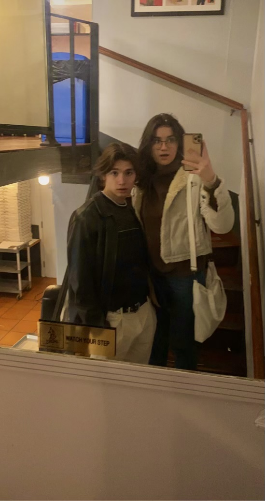
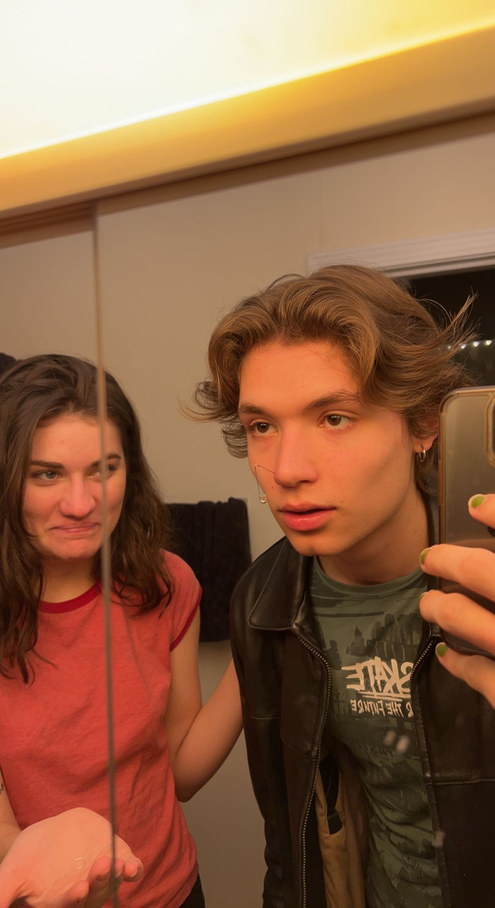
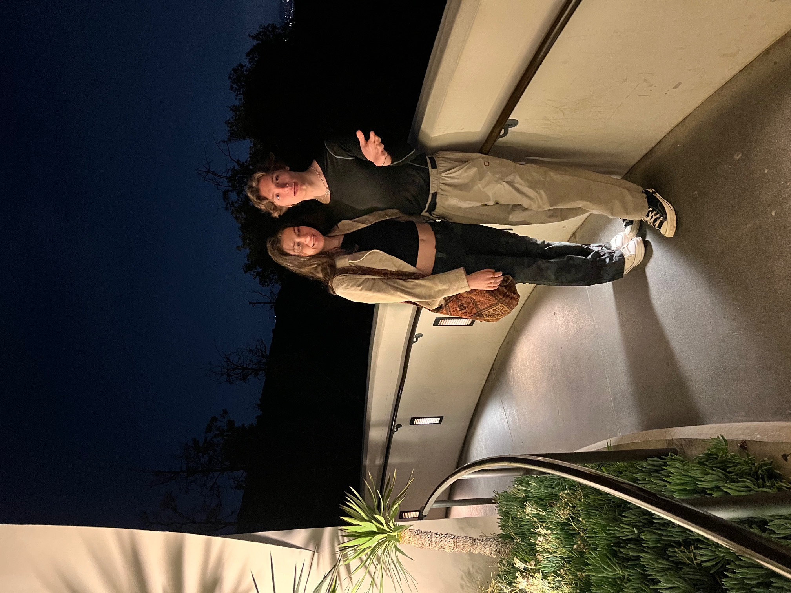
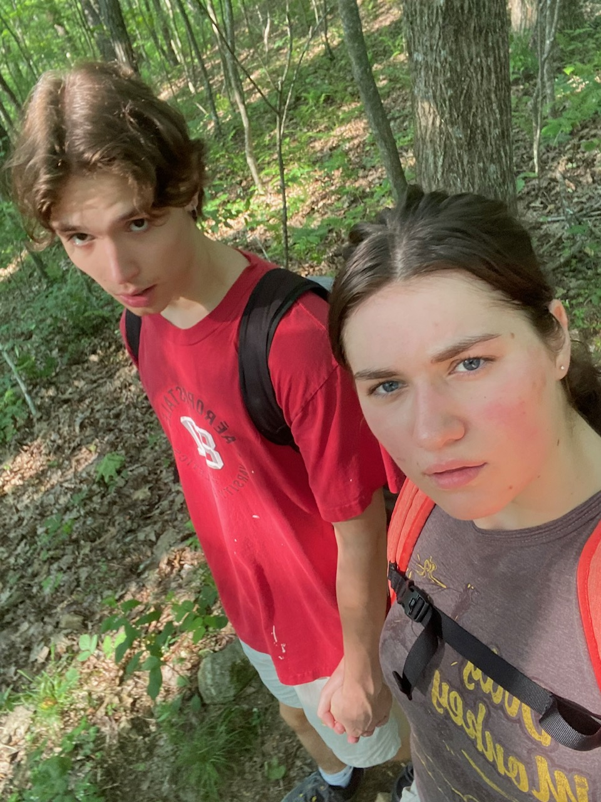
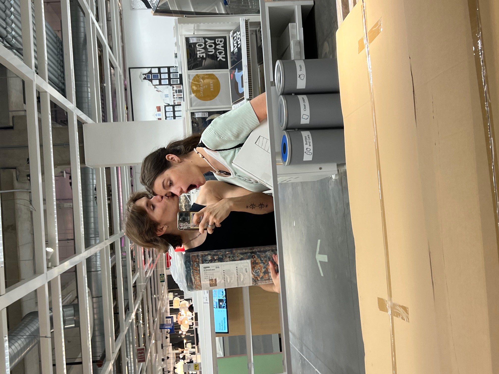

# www.phillipheartsevey.com/
Web development project I made for my 1-year anniversary with my partner. See working project at domain above.

# Description
This web application utilizes HTML, CSS, and JavaScript to create an elegant UI that demonstrates the love and care I put into this project. Inside the page, you will find a real-time clock that displays how long my partner and I have been together. Furthermore, you will see a simple image gallery embodying our time together.

# Installation
```bash
git clone https://github.com/philbreunig/phillipheartsevey.git
cd phillipheartsevey
```

# Impressive Site Attributes
## Typewriter Effect
Casscading text that displays upon loading site.
```javascript
const element1 = document.querySelector('#typewriter1');
const bigText = "Hi Evey, time flies with you and sometimes I get at a loss for words when talking about us. I thought I could fix both those things by coding it. :)";
const element2 = document.querySelector('#typewriter2');
const smallText = "In case we lose track of it over the years, here is how long its been since you've given me the chance to love you:";

function updateText(element, text, i = 0) {
    element.textContent += text[i];

    if (i === text.length - 1) {
        return;
    }

    setTimeout(() => { updateText(element, text, i + 1)}, 30);
}

setTimeout(() => { updateText(element1, bigText) }, 100);
```
```html
<div class="messageBox">
    <h2 class="message" id="typewriter1"></h2>
</div>
<div class="littleMessageBox">
    <p class="littleMessage" id="typewriter2">In case we lose track of it over the years, here is how long its been since you've given me the chance to love you:</p>
</div>
```

## Love Clock
Star of the Site; clock that tracks (live) time between start of relationship and current-day.
```javascript
// Function to compute and display length of anniversary
var startDateTime = new Date(2022,8,11,0,0,0,0); // YYYY (M-1) D H m s (start time and date from DB)
var startStamp = startDateTime.getTime();
        var newDate = new Date();
        var newStamp = newDate.getTime();

        var timer;

        function updateClock() {
            newDate = new Date();
            newStamp = newDate.getTime();
            var diff = Math.round((newStamp-startStamp)/1000);

            var y = Math.floor(diff/(365*24*60*60));
            diff = diff-(y*365*24*60*60);
            var d = Math.floor(diff/(24*60*60));
            diff = diff-(d*24*60*60);
            var h = Math.floor(diff/(60*60));
            diff = diff-(h*60*60);
            var m = Math.floor(diff/(60));
            diff = diff-(m*60);
            var s = diff;

            document.getElementById("time-elapsed").innerHTML = y+" year(s), " +d+" day(s), "+h+" hour(s), "+m+" minute(s), "+s+" second(s) in love";
        }

        setInterval(updateClock, 1000);
```
```html
<p class="time" id="time-elapsed"></p>
```

## Image Gallery
Sliding image gallery.
```javascript
const gallery = document.querySelector('.gallery-images');
const images = document.querySelectorAll('.gallery-images img');
let index = 0;

document.querySelector('.next').addEventListener('click', () => {
  index = (index + 1) % images.length; // Loop back to first image
  updateGallery();
});

document.querySelector('.prev').addEventListener('click', () => {
  index = (index - 1 + images.length) % images.length; // Loop back to last image
  updateGallery();
});

var $setter = $("#setter");
$setter.siblings(".wrap").css("max-width", $setter.width()+"px");

function updateGallery() {
  const imageWidth = document.querySelector('.image-gallery').clientWidth; // Get container width
  gallery.style.transform = `translateX(${-index * imageWidth}px)`; // Move horizontally by image width
}
```
```html
<div class="gallery-container">
            <button class="prev">&#10094;</button>
            
            <div class="image-gallery">
              <div class="gallery-images">
                
                
                
                
                
                
                
                
              </div>
            </div>
            
            <button class="next">&#10095;</button>
</div>
```

# Code Referencing
I made this project out of my passion to create and learn. Feel free to use any segments of the code above.
